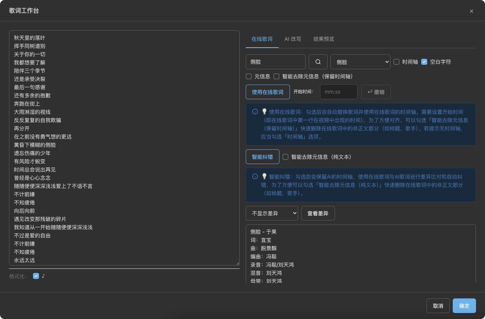
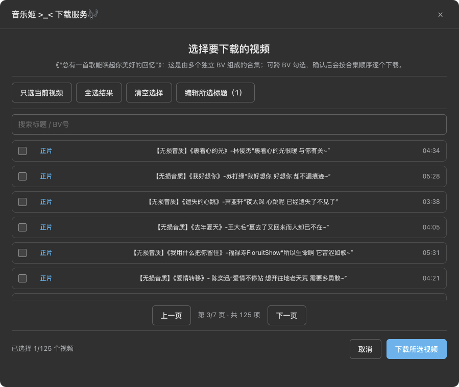

# 🎵 平台音乐下载助手

> 一站式音频下载与处理工具，支持封面嵌入、ID3 标签、歌词字幕

## ✨ 主要特性

### 🎧 智能下载

- 一键提取视频音频，支持多音质选择
- 自动嵌入封面、ID3 标签、歌词字幕
- 支持批量下载合集/分P视频

### 🎬 音频剪辑

- 可视化时间轴，精准裁剪音频片段
- 支持多段删除，保留精华部分
- 倍速播放预览，一键导出

### 📝 歌词工作台

- AI 智能纠错，自动修正字幕错误
- 在线歌词搜索，支持多种语言
- 实时预览编辑，支持 LRC 格式导出

### 🎨 封面定制

- 多封面源选择：视频封面、音乐封面、UP 主头像
- 自定义裁剪，完美适配播放器

### 🌙 深色模式

- 完整的深色模式支持
- 跟随系统主题自动切换

## 📸 预览

- 主界面 
  

- 歌词工作台 
  

- 批量下载 
  

## 🚀 安装使用

1. 安装 [Tampermonkey](https://www.tampermonkey.net/) 浏览器扩展
2. 点击安装脚本：[GreasyFork](https://greasyfork.org/zh-CN/scripts/) 或 [GitHub](https://github.com/ocyss/bilibili-music)
3. 访问平台视频页面，点击播放器下方的下载按钮

## 🔧 技术栈

- **前端**: Vue 3 + Vite
- **音频处理**: FFmpeg WASM（支持多线程）
- **歌词修正**: AI 智能纠错算法
- **存储**: Tampermonkey 持久化 API

## 📋 功能清单

| 功能         | 状态 |
| ------------ | ---- |
| 音频下载     | ✅   |
| 封面嵌入     | ✅   |
| ID3 标签     | ✅   |
| 歌词字幕     | ✅   |
| 音频剪辑     | ✅   |
| 批量下载     | ✅   |
| 深色模式     | ✅   |
| 歌词纠错     | ✅   |
| 在线歌词搜索 | ✅   |

## ⚠️ 安全声明

使用本脚本下载音频文件时，请注意以下几点：

1. **个人使用**: 本脚本仅供个人学习和娱乐使用，请勿用于商业用途。
2. **尊重版权**: 请尊重视频和音频的原始创作者的版权。下载的音频文件仅供个人收藏，请勿进行再分发或商业化。
3. **风险提示**: 使用本脚本可能会违反哔哩哔哩网站的服务条款，请自行承担使用本脚本可能带来的风险。

## 🤝 贡献

欢迎提交 Issue 和 Pull Request！

## 🔗 相关链接

- [GitHub 仓库](https://github.com/ocyss/bilibili-music)
- [GreasyFork](https://greasyfork.org/zh-CN/scripts/)

## 🙏 致谢

- [vite-plugin-monkey](https://github.com/lisonge/vite-plugin-monkey)
- [FFmpeg WASM](https://github.com/ffmpegwasm/ffmpeg.wasm)

## 📊 Star 趋势

<a href="https://star-history.com/#ocyss/bilibili-music&Date">
 <picture>
   <source media="(prefers-color-scheme: dark)" srcset="https://api.star-history.com/svg?repos=ocyss/bilibili-music&type=Date&theme=dark" />
   <source media="(prefers-color-scheme: light)" srcset="https://api.star-history.com/svg?repos=ocyss/bilibili-music&type=Date" />
   
 </picture>
</a>
